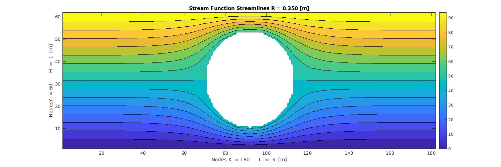

# Non-vicous-potential-flow-analysis

This codes develops a flow analyais using the potential theory which simplifies the Navier-Stokes stokes euqations 
in order to obtain a valid result for certain cituation where the visocity is not important.

The code structure is described in the following image:


Some of the results you should get when runing the code are:


  | 

## Code report 

```
*Abstract* |  This report is aimed to provide the reader with a first approach to the computational fluid dynamics simulations field focusing on potential flows. In this report the analysis of three use cases will be analysed and the code structure and a brief theoretical analysis of the problems will be done.
```

The report can be found here in the following link


Please contact me to the following email if you find any mistake ar have any questions regarding the development:

>edgargc.upc@gmail.com
